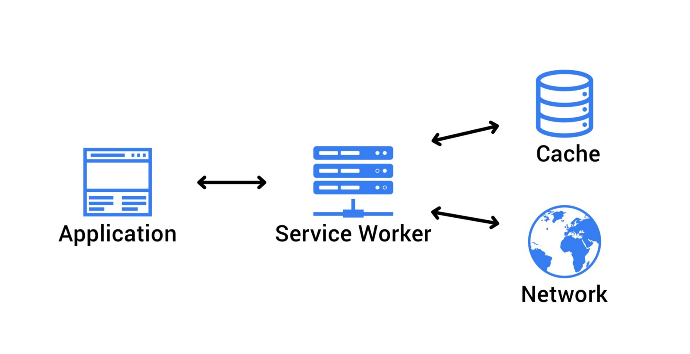
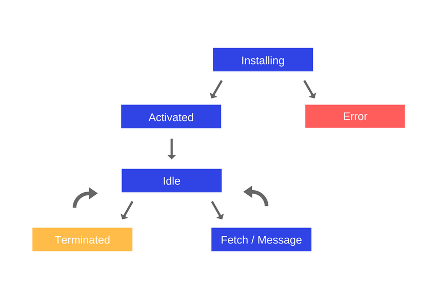
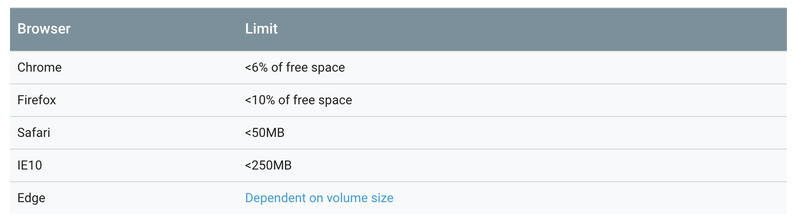

import { Head, Image, Appear } from 'mdx-deck'

export { default as theme } from './theme'

<Head>
  <title>Presentation Title</title>
</Head>

# Service Worker Series ⚡:
## Offline Content Caching

```notes
- Showcase application and say how we could implement offline Caching
- Then come to this first slide
```

---

## So, what's a Service Worker?

---



```notes
- A service worker is resilience layer that sits between your application and the network.
- It can be used for intersecting requests
- It's just javascript code, is a script that you include in your page
- Most of the times, our app does not need to be aware of the service worker
```

---

## What can I do with it?

* Intersect requests and respond them
* Caching content for offline usage
* Push notifications
* Background sync

---

## What can I do with it?

* Intersecting requests and responding them
* :sparkles: **Caching content for offline usage** :sparkles:
* Push notifications
* Background sync

---

### What do we want to accomplish?

<Appear>
  <p>We want to show the user favorites gifs</p>
  <p style={{ marginTop: '-20px' }}>Even when offline</p>
</Appear>

---

## How do we accomplish this task?

---

## We need to cache:

1. The application shell (HTML, CSS, JS)
2. The JSON data associated with the gif
3. The actual gif image

```notes
- The app shell is the minimum set of HTML, CSS and JS
- After we store the JSON data associated with the gif we still need to cache the actual image
```

---

## Caching the application shell

<Appear>
  <h3>Use precaching!</h3>
</Appear>

---

## Service Worker lifecycle



---

### Caching the JSON data associated with the gif

- `localStorage`
- `indexDB`
- `pouchDB`


```notes
we could use browser native solutions like localStorage or indexDB
or we could use an abstraction like pouchDB
```

---

# Caching the images

---


---



https://developers.google.com/web/fundamentals/instant-and-offline/web-storage/offline-for-pwa#how_much_can_i_store

---

### How can this be improved?

- Using `indexDB` instead of `localStorage`
- Use a different method for responding with the cached images

```notes
- It may be more performant to use indexDB, as it does it's store operations async, so it won't freeze the UI
- When selecting images to cache, we're just matching all of the images URL
```

---

## Next Steps and resources:

- Write some _vanilla_ service workers
- Check workbox!
- Service Workers lifecycle
- Application Shell Pattern

---

- https://developers.google.com/web/fundamentals/primers/service-workers/
- https://developers.google.com/web/fundamentals/primers/service-workers/lifecycle
- https://developers.google.com/web/fundamentals/architecture/app-shell
- https://developers.google.com/web/fundamentals/instant-and-offline/web-storage/offline-for-pwa
- Code repo: https://github.com/TheMightyPenguin/Giffr
